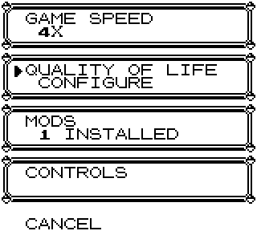
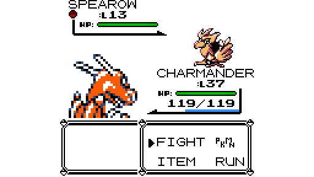
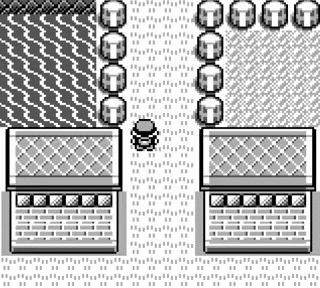
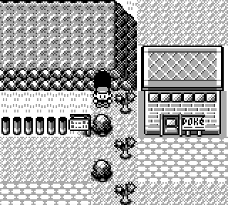

# Quality of Life additions from later generations

Adds optional, later generation style options.
Can be toggled individually.

## Installation

Download the newest release: https://github.com/unxpected-uxp/pokemon-gen1-recomp-mod-qol
and extract the `quality_of_life` folder into the game's `mods` directory.

### Portable mode

Place it beside the game:

`<game folder>/mods/quality_of_life/`

### Non-portable mode

- Windows: `%APPDATA%\pokemon-love2d\mods\quality_of_life\`
- macOS: `~/Library/Application Support/pokemon-love2d/mods/quality_of_life/`
- Linux: `~/.local/share/pokemon-love2d/mods/quality_of_life/`

## Usage

After installing, features default to **OFF**.

<figure>
  <figcaption>
    <em>
      Configure the mod under OPTION → QUALITY OF LIFE
    </em>
  </figcaption>
  
</figure>

<figure>
  <figcaption>
    <em>
      XP bar and caught Pokémon indicator (Gen2 style), supports normal and wide battle modes
    </em>
  </figcaption>
  
</figure>

<figure>
  <figcaption>
    <em>
      Location banners (Gen2 style)
    </em>
  </figcaption>
  
</figure>

<table>
  <tr>
    <td align="center" valign="top">
      <strong><em>Easy interactions</em></strong>  
      
    </td>
    <td valign="top">
        
      When <strong>CUT</strong> or <strong>STRENGTH</strong> is available, press <kbd>A</kbd> while  
      facing bushes or boulders to activate it automatically.
        
      When facing water, press <kbd>A</kbd> to <strong>SURF</strong> or <strong>FISH</strong>. If both  
      are available, a selection popup appears.
        
      When <strong>FLY</strong>, <strong>DIG</strong>, <strong>FLASH</strong>, and/or <strong>TELEPORT</strong> are  
      available, press <kbd>SELECT</kbd> to choose which one to use.
        
      Save yourself countless button presses and avoid  unnecessary menu navigation.
    </td>
  </tr>
</table>
